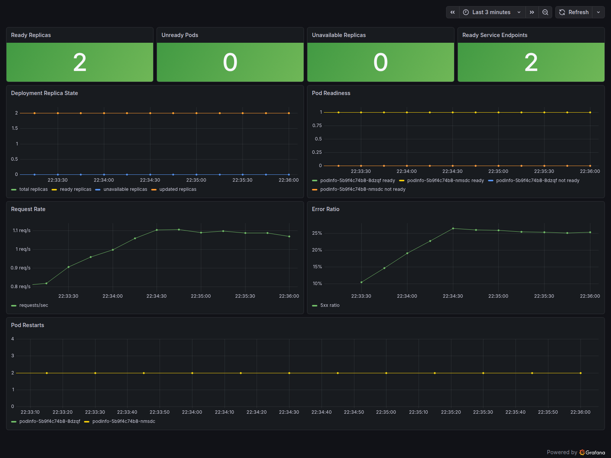

# K8s Incident Lab

This project is a hands-on Kubernetes troubleshooting lab. It uses repeatable failure injection to demonstrate how to diagnose Pods, Deployments, Services, Endpoints, readiness probes, resource limits, metrics, logs, and alerts.

The scripts make the failures reproducible. The value of the lab is the manual investigation path: observe the cluster, isolate the failure mode, explain the root cause, and recover the workload.

Stack: K3s · Podinfo · Prometheus · Grafana · Loki · Promtail · Helm · kube-prometheus-stack.



## What This Proves

| Kubernetes Skill | Evidence in This Project | Why It Matters |
|---|---|---|
| Pod debugging | Uses `kubectl get pods`, `describe pod`, container status, Events, and logs | Most incidents start with proving what changed at the Pod level |
| Readiness vs liveness | Shows Pods that are Running but not Ready, then verifies Endpoint removal | Prevents confusing container health with traffic eligibility |
| Deployment reconciliation | Deletes a Pod and observes the Deployment/ReplicaSet recreate it | Demonstrates desired state and self-healing behavior |
| Service discovery | Breaks a Service selector and compares selectors, labels, and Endpoints | Explains why healthy Pods can still receive no traffic |
| Resource limits | Triggers OOMKilled and inspects restart count, last state, and exit code 137 | Connects resource configuration to runtime failure behavior |
| Observability | Maps Grafana panels, Prometheus alerts, Loki logs, and runbooks to each scenario | Turns symptoms into evidence-driven incident response |
| Platform automation | Provides repeatable bash and PowerShell entry points for setup, failure injection, and recovery | Keeps the lab reproducible without hiding the debugging workflow |

## Outcomes

- Diagnosed readiness failures using Pod conditions, Kubernetes Events, rollout state, and Service Endpoints.
- Demonstrated Deployment self-healing by deleting Pods and observing controller-driven replacement.
- Diagnosed Service selector mismatch by comparing Service selectors, Pod labels, and Endpoint availability.
- Identified OOMKilled behavior through container last state, restart count, memory limits, and Prometheus signals.
- Separated application-level HTTP 500 failures from Kubernetes-level health by combining metrics and logs.
- Built a full observability stack with Prometheus, Grafana, Loki, Promtail, dashboards, alerts, and runbook links.
- Built a local operator console with 16 lab actions and a namespace-limited guided terminal for repeatable practice.

## Repository Structure

```text
k8s-incident-lab/
+-- app/
|   +-- manifests/
+-- docs/
|   +-- architecture.md
|   +-- scenarios.md
|   +-- screenshots/
+-- monitoring/
|   +-- dashboards/
|   +-- helm-values/
|   +-- servicemonitors/
+-- runbooks/
+-- scenarios/
+-- scripts/
+-- console/
```

## Prerequisites

- A working K3s or Kubernetes cluster
- `kubectl`
- `helm`
- `curl`

Confirm cluster access:

```bash
kubectl get nodes
```

## Quick Start

Deploy the demo app, monitoring stack, and local access:

```bash
scripts/deploy-app.sh
scripts/install-monitoring.sh
scripts/port-forward.sh
```

Run the local lab console:

```bash
scripts/run-console.sh
```

Then open the printed local URL in your browser.

Check the lab status at any time:

```bash
scripts/status.sh
```

Common shortcuts are also available through `make`:

```bash
make deploy
make monitoring
make port-forward
make stop-port-forward
make console
make status
make alerts
```

On Windows PowerShell, use the matching `.ps1` scripts:

```powershell
.\scripts\deploy-app.ps1
.\scripts\install-monitoring.ps1
```

Open Grafana:

```bash
scripts/port-forward.sh
```

Then open:

```text
Grafana:    http://localhost:3000
Prometheus: http://localhost:9090
Podinfo:    http://localhost:9898
```

Stop local port-forwards:

```bash
scripts/stop-port-forward.sh
```

Default login:

```text
admin / admin
```

Open the dashboard:

```text
Incident Lab / Podinfo Overview
```

Grafana usage guide:

- [docs/grafana-guide.md](docs/grafana-guide.md)

Troubleshooting:

- [docs/troubleshooting.md](docs/troubleshooting.md)

Alerts:

- [docs/alerts.md](docs/alerts.md)

Demo flow:

- [docs/demo-flow.md](docs/demo-flow.md)

Screenshot guide:

- [docs/screenshots/README.md](docs/screenshots/README.md)

## Validate the App

Port-forward Podinfo:

```bash
scripts/port-forward.sh
```

Test it:

```bash
curl http://localhost:9898/
curl http://localhost:9898/readyz
curl http://localhost:9898/metrics
```

## Incident Scenarios

Each scenario starts with a script only to create a consistent failure. The investigation and recovery steps are intentionally shown as Kubernetes operations.

### 1. Readiness Probe Failure

Failure injection:

```bash
scripts/trigger-readiness-failure.sh
```

Manual investigation:

```bash
kubectl -n incident-lab get pods
kubectl -n incident-lab describe pod -l app.kubernetes.io/name=podinfo
kubectl -n incident-lab get endpoints podinfo
kubectl -n incident-lab get events --sort-by=.lastTimestamp
```

Root cause:

The Deployment is patched with a readiness probe that does not succeed, so the Pod can be Running while Kubernetes keeps it out of Service Endpoints.

Kubernetes concept:

Readiness controls traffic eligibility. Liveness controls container restart behavior.

Recovery:

```bash
scripts/restore-readiness.sh
kubectl -n incident-lab rollout status deploy/podinfo
kubectl -n incident-lab get endpoints podinfo
```

PowerShell equivalents are available under `scripts/*.ps1`.

Runbook: [runbooks/readiness-failure.md](runbooks/readiness-failure.md)

### 2. High Error Rate

Failure injection:

```bash
scripts/generate-errors.sh
```

Manual investigation:

```bash
kubectl -n incident-lab get pods
kubectl -n incident-lab logs deploy/podinfo --tail=100
scripts/show-alerts.sh
```

Grafana/Loki evidence:

- Grafana `Error Ratio`
- Grafana `Request Rate`
- Loki query: `{namespace="incident-lab"} |= "500"`
- Prometheus alert: `PodinfoHighErrorRate`

Root cause:

The application returns HTTP 500 responses while Kubernetes still sees healthy Pods.

Kubernetes concept:

Not every outage is a Kubernetes scheduling or readiness problem. Application metrics and logs are required when Pods are healthy but users still see errors.

Runbook: [runbooks/high-error-rate.md](runbooks/high-error-rate.md)

### 3. Pod Self-healing

Failure injection:

```bash
scripts/trigger-pod-self-healing.sh
```

Manual investigation:

```bash
kubectl -n incident-lab get pods -w
kubectl -n incident-lab get rs
kubectl -n incident-lab get events --sort-by=.lastTimestamp
```

Root cause:

A Pod is deleted manually, creating drift between desired state and actual state.

Kubernetes concept:

The Deployment controller reconciles actual state back to desired state by creating a replacement Pod through its ReplicaSet.

Runbook: [runbooks/pod-self-healing.md](runbooks/pod-self-healing.md)

### 4. OOMKilled

Failure injection:

```bash
scripts/trigger-oom-killed.sh
```

Manual investigation:

```bash
kubectl -n incident-lab get pods -w
kubectl -n incident-lab describe pod -l app.kubernetes.io/name=podinfo
kubectl -n incident-lab get deploy podinfo -o jsonpath='{.spec.template.spec.containers[0].resources}'
scripts/show-alerts.sh
```

Root cause:

The container memory limit is reduced below what the process needs, so the kernel kills it and Kubernetes reports `OOMKilled`.

Kubernetes concept:

Exit code 137, restart count, container last state, and memory limits together explain whether the workload crashed or was killed by resource pressure.

Recovery:

```bash
scripts/restore-oom-killed.sh
kubectl -n incident-lab rollout status deploy/podinfo
```

Runbook: [runbooks/oom-killed.md](runbooks/oom-killed.md)

### 5. Service Discovery Broken

Failure injection:

```bash
scripts/trigger-service-discovery-broken.sh
```

Manual investigation:

```bash
kubectl -n incident-lab get pods --show-labels
kubectl -n incident-lab describe svc podinfo
kubectl -n incident-lab get endpoints podinfo
curl http://localhost:9898/
```

Root cause:

The Service selector no longer matches the Pod labels, so healthy Pods exist but the Service has no ready Endpoints.

Kubernetes concept:

Services route to Endpoints selected by labels. A label/selector mismatch can break traffic without making Pods unhealthy.

Recovery:

```bash
scripts/restore-service-discovery-broken.sh
kubectl -n incident-lab get endpoints podinfo
```

Runbook: [runbooks/service-discovery-broken.md](runbooks/service-discovery-broken.md)

## Useful Commands

Validate the repository:

```bash
scripts/validate.sh
```

Show Prometheus alerts:

```bash
scripts/show-alerts.sh
```

Check app state:

```bash
kubectl -n incident-lab get all
kubectl -n incident-lab describe deploy podinfo
kubectl -n incident-lab logs deploy/podinfo --tail=100
```

Check monitoring state:

```bash
kubectl -n monitoring get pods
kubectl -n monitoring get svc
```

Query recent events:

```bash
kubectl -n incident-lab get events --sort-by=.lastTimestamp
```

## Cleanup

```bash
scripts/cleanup.sh
```

## MVP Status

- [x] Demo app manifests
- [x] Prometheus / Grafana Helm values
- [x] Prometheus alert rules
- [x] Loki / Promtail Helm values
- [x] Grafana dashboard ConfigMap
- [x] Local lab console
- [x] Readiness failure scenario
- [x] High error rate scenario
- [x] Pod self-healing scenario
- [x] OOMKilled scenario
- [x] Service discovery broken scenario
- [x] Runbooks
- [x] Helper scripts
- [x] Screenshots from a real cluster run

## Future Improvements

- Alertmanager rules and notification routing
- Ingress and TLS
- GitHub Actions CI validation
- SLO dashboard (availability SLI + error budget)
